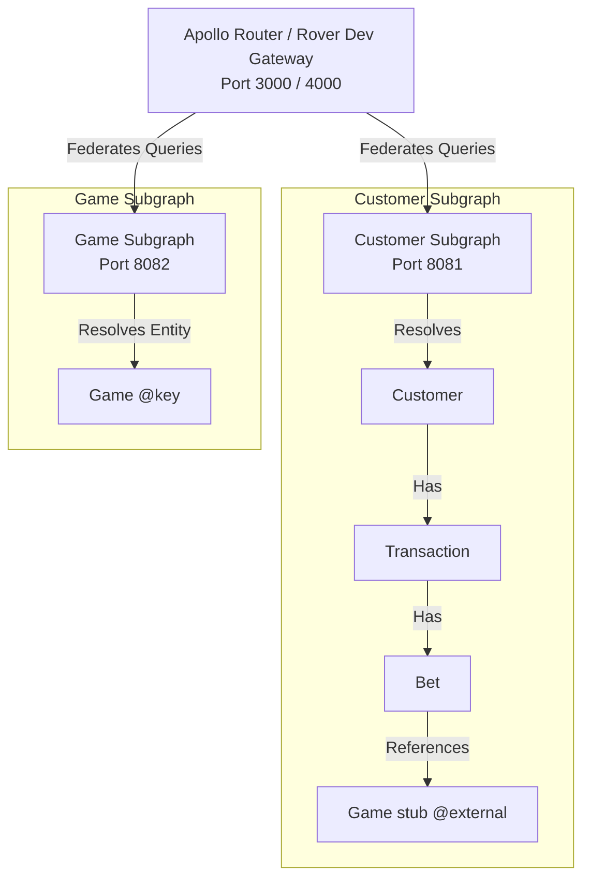

# Federated GraphQL Example (Golang + gqlgen + Apollo Federation v2)

A high-performance, federated GraphQL supergraph implementation using **Go (1.25)**, **gqlgen**, and **Apollo Federation v2**.

This repository demonstrates a microservices architecture where separate subgraphs (Customer Subgraph and Game Subgraph) are composed into a unified Supergraph Gateway using Apollo Rover.

---

## 🗺️ Architecture Overview



### Subgraph Boundaries
- **Customer Subgraph** (Port `8081`): Manages customer profiles, transactions, and betting slips. It references `Game` as an external entity stub, requiring only the `id` field.
- **Game Subgraph** (Port `8082`): Manages game definitions and metadata (names, market types). It implements the `@key` directive and exposes an entity resolver (`FindGameByID`) so the gateway can dynamically hydrate game information requested under any bet.

---

## 📁 Repository Directory Layout

* [Makefile](file:///Users/oscargarcia/workspace/fed-gql-example/Makefile): Defines commands to spin up subgraphs and run the Apollo composition tool.
* [supergraph-config.yaml](file:///Users/oscargarcia/workspace/fed-gql-example/supergraph-config.yaml): Composition configuration for Rover.
* [customer-subgraph/](file:///Users/oscargarcia/workspace/fed-gql-example/customer-subgraph):
  * [customer-subgraph/graph/schema.graphqls](file:///Users/oscargarcia/workspace/fed-gql-example/customer-subgraph/graph/schema.graphqls): GraphQL schema for customers, transactions, and bets.
  * [customer-subgraph/graph/schema.resolvers.go](file:///Users/oscargarcia/workspace/fed-gql-example/customer-subgraph/graph/schema.resolvers.go): Resolver implementations.
  * [customer-subgraph/server.go](file:///Users/oscargarcia/workspace/fed-gql-example/customer-subgraph/server.go): Entrypoint server.
* [game-subgraph/](file:///Users/oscargarcia/workspace/fed-gql-example/game-subgraph):
  * [game-subgraph/graph/schema.graphqls](file:///Users/oscargarcia/workspace/fed-gql-example/game-subgraph/graph/schema.graphqls): GraphQL schema for games.
  * [game-subgraph/graph/schema.resolvers.go](file:///Users/oscargarcia/workspace/fed-gql-example/game-subgraph/graph/schema.resolvers.go): Resolver implementations.
  * [game-subgraph/graph/entity.resolvers.go](file:///Users/oscargarcia/workspace/fed-gql-example/game-subgraph/graph/entity.resolvers.go): Apollo Federation entity resolver (`FindGameByID`).
  * [game-subgraph/server.go](file:///Users/oscargarcia/workspace/fed-gql-example/game-subgraph/server.go): Entrypoint server.

---

## 🚀 Getting Started

### Prerequisites
1. **Go 1.25+** installed.
2. **Apollo Rover CLI** installed for local supergraph composition.

### 1. Run Subgraphs Concurrently
Use the provided `Makefile` to spin up both the Customer and Game subgraphs at the same time:
```bash
make start-all
```
This runs:
* **Customer Subgraph**: `http://localhost:8081/` (Playground) / `http://localhost:8081/query` (Endpoint)
* **Game Subgraph**: `http://localhost:8082/` (Playground) / `http://localhost:8082/query` (Endpoint)

### 2. Start Rover Dev (Supergraph Gateway)
In a separate terminal, launch the local composition and gateway server using Rover:
```bash
make rover-dev
```
This composed supergraph gateway is accessible via the Apollo Router terminal logging (usually `http://localhost:4000` or `http://localhost:3000`), allowing you to query across both subgraphs seamlessly.

---

## 🔍 Verification & Testing

### Supergraph Query
To verify that nested federation hydration is working properly, query the Gateway with the following unified execution block:

```graphql
query GetCustomerActivityRecord {
  customer(id: "cust_usr_901") {
    transactions {
      customerID
      bets {
        id
        amount
        game {
          id
          name
          marketTypeID
          isMatch
        }
      }
    }
  }
} 
```

#### Expected Federated Response
The gateway fetches the transaction and bet list from the **Customer Subgraph**, identifies that the `Game` field references an external entity, and queries the **Game Subgraph** using the entity resolver to fill in the game `name` and `marketTypeID`:

```json
{
  "data": {
    "customer": {
      "transactions": [
        {
          "customerID": "cust_usr_901",
          "bets": [
            {
              "id": "bet_001",
              "amount": 120.5,
              "game": {
                "id": "game_777",
                "name": "Championship Basketball Finals",
                "marketTypeID": "mt_point_spread",
                "isMatch": true
              }
            },
            {
              "id": "bet_002",
              "amount": 45,
              "game": {
                "id": "game_888",
                "name": "World Cup Tennis Open",
                "marketTypeID": "mt_match_winner",
                "isMatch": true
              }
            },
            {
              "id": "bet_003",
              "amount": 100,
              "game": {
                "id": "game_999",
                "name": "F1 racing",
                "marketTypeID": "multi_runner",
                "isMatch": false
              }
            }
          ]
        }
      ]
    }
  }
}
```

---

## 🛠️ Code Generation

If you modify either of the subgraph schemas, regenerate the boilerplate code structures using the provided Makefile commands:

```bash
# Generate gqlgen code for both subgraphs
make generate

# Or generate for a specific subgraph
make generate-customer
make generate-game
```
